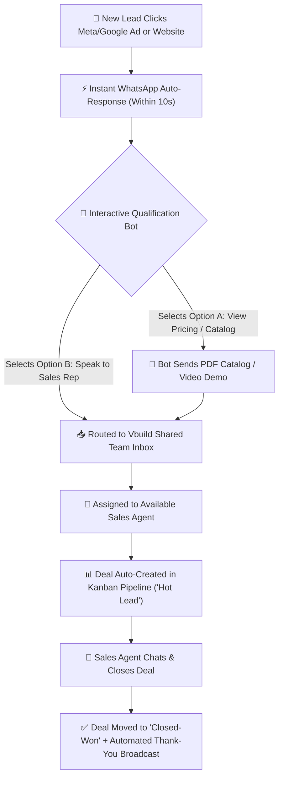
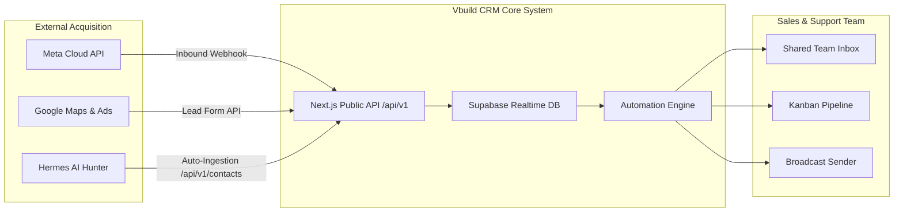

# 📊 Vbuild CRM — Product Presentation & Workflow Deck

This document contains:
1. **The AI Presentation Prompt** (Copy & paste into Gamma.app, ChatGPT, Canva, or Pitch.com to generate a 10-slide visual PPT).
2. **The Complete System Flowcharts** (Visual Mermaid diagrams showing how Vbuild CRM works end-to-end for leads, sales reps, and business owners).

---

## 🤖 1. AI PPT Generation Prompt

> **Copy & paste this prompt into [Gamma.app](https://gamma.app) or [ChatGPT](https://chatgpt.com) to generate a complete visual deck:**

```markdown
Create a high-converting, professional 10-slide pitch presentation for "Vbuild CRM" — a high-performance WhatsApp CRM & Sales Automation Platform. 

The tone should be authoritative, modern, and business-focused. Include clear visual flowcharts, comparison tables, and ROI stats on every slide.

SLIDE 1: Title & Hero Value Proposition
- Title: Vbuild CRM — Turn WhatsApp into a 24/7 Sales Engine
- Subtitle: The All-in-One Shared Team Inbox, Automated Chatbot, and Pipeline CRM for Modern Businesses.
- Visual: Modern glassmorphism graphic with a WhatsApp green glowing border.

SLIDE 2: The Core Problem (The Lead Leakage Crisis)
- 60% of Meta/Google ad leads go cold because businesses take 2+ hours to reply.
- Sales reps handle client chats on personal phones — lost conversation history when agents leave.
- Zero visibility for business owners on sales rep response times and closed deals.

SLIDE 3: The Vbuild Solution (How It Works - High-Level Flow)
- Flowchart 1: Facebook/Google Ad Click -> Instant WhatsApp Welcome Message (10 Sec) -> Interactive Qualification Bot -> Assigned Sales Rep -> Closed Deal.

SLIDE 4: Feature 1 — Multi-Agent Shared Team Inbox
- 5+ sales reps operating off ONE official WhatsApp Business Number (+91 62653 56811).
- Real-time conversation assignment, internal team notes, and live agent activity tracking.

SLIDE 5: Feature 2 — No-Code Visual Chatbots & Automations
- 24/7 automated lead screening with interactive Quick-Reply buttons.
- Instant routing: "Inquire Pricing" -> Auto-Send PDF Brochure -> Create Deal in Sales Pipeline.

SLIDE 6: Feature 3 — Visual Kanban Sales Pipelines
- Drag-and-drop deal management: [New Lead] -> [Demo Scheduled] -> [Proposal Sent] -> [Closed Won].
- Automated WhatsApp follow-up triggers when a deal moves to a new stage.

SLIDE 7: Feature 4 — Targeted Mass Broadcasts (100% Meta Compliant)
- Send personalized promotional templates to thousands of opted-in customers safely.
- Real-time delivery, read-rate tracking, and opt-out filter management.

SLIDE 8: Industry Use-Cases & Workflow Blueprints
- Real Estate: Instant property brochure dispatch on ad click.
- Coaching/EdTech: Automated student qualification & course booking.
- Clinics: 2-way appointment confirmation to cut no-shows by 90%.

SLIDE 9: Pricing Tiers & Return on Investment (ROI)
- Starter Plan (₹2,999/mo) | Growth Plan (₹7,499/mo) | Enterprise (Custom).
- ROI Math: Closing just 1 extra lead per month pays for the CRM 5x over.

SLIDE 10: Call to Action & Next Steps
- Try Live Demo: https://vbuild-automation.netlify.app
- Book Free 15-Min Setup Consultation: Contact Sales Team.
```

---

## 🔄 2. End-to-End System Flowcharts

### A. Main Customer & Sales Workflow Chart



---

### B. Technical & Data Integration Architecture



---

## 🎨 3. Slide-by-Slide Visual Mockup Layout

| Slide # | Slide Title | Key Visual Graphic | Core Metric / Takeaway |
| :--- | :--- | :--- | :--- |
| **Slide 1** | **Vbuild CRM Intro** | Glowing WhatsApp Green UI Banner | 3x Higher Lead Conversion |
| **Slide 2** | **The Problem** | Red Alarm Warning Graphic | 60% Ad Leads Wasted |
| **Slide 3** | **How It Works Flow** | 4-Step Arrow Flowchart | Reply Speed < 10 Seconds |
| **Slide 4** | **Shared Team Inbox** | Multi-Avatar Team Graphic | 5+ Reps, 1 Phone Number |
| **Slide 5** | **AI Chatbot Engine** | Interactive Button Preview | 24/7 Qualification |
| **Slide 6** | **Kanban Pipeline** | Drag-and-Drop Stage Cards | Zero Lost Opportunities |
| **Slide 7** | **Mass Broadcasts** | Delivery Analytics Graph | 98% WhatsApp Open Rate |
| **Slide 8** | **Industry Solutions** | Real Estate / EdTech Icons | Tailored Workflows |
| **Slide 9** | **Pricing & ROI** | Clear 3-Column Price Cards | 5x ROI Guaranteed |
| **Slide 10** | **Call to Action** | Live Demo URL + QR Code | Start Free Trial Today |
