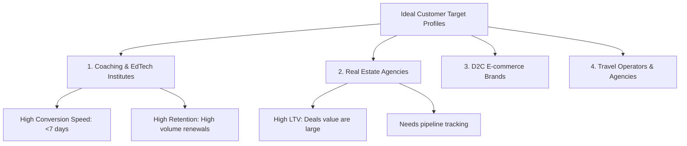

# WACRM (LoopX CRM) Market Expansion & Go-To-Market (GTM) Strategy

This document provides a comprehensive, founder-level business analysis, monetization strategy, sales playbook, and Go-To-Market roadmap for WACRM (WhatsApp CRM) to build a ₹100 Crore ARR ($12M USD) SaaS company.

---

## Phase 1: CRM Business Analysis

### 1. Contacts
* **What Problem It Solves:** Scattered client data across spreadsheets, personal phones, and sticky notes. Eliminates "data silos" where customer histories are lost when sales agents leave.
* **Who Needs It:** Every B2C and B2B business with >100 clients.
* **Business Value:** A single, secure, cloud-based repository of truth. Enables institutional memory of every customer relationship.
* **ROI for Customers:** Saves 3–5 hours/week per agent spent hunting for phone numbers, previous chats, and customer details. Prevents lead leakage.
* **Revenue Impact (for WACRM):** Core retention feature. Database growth drives tier upgrades (pricing based on contact volume).

### 2. Leads
* **What Problem It Solves:** Leads coming from multiple channels (Meta Ads, Google, website) get neglected. No clear mechanism to distinguish high-intent prospects from cold ones.
* **Who Needs It:** Sales directors, marketing teams, and business owners.
* **Business Value:** Centralizes lead intake and tracks the cost per acquired lead against conversion outcomes.
* **ROI for Customers:** Increases lead-to-opportunity conversion rate by 15–20% through structured tracking and instant capture.
* **Revenue Impact:** Encourages third-party integrations (Zapier, custom webhooks) which are premium add-ons.

### 3. Pipelines
* **What Problem It Solves:** Sales processes are a "black box." Management has no visibility into deal stages, bottlenecked sales cycles, or revenue forecasting.
* **Who Needs It:** Sales Managers, CEOs, and Account Executives.
* **Business Value:** Visual Kanban board for pipeline velocity analysis, deal value forecasting, and agent performance tracking.
* **ROI for Customers:** Shortens sales cycle length by 20–30% by identifying exactly where deals get stuck.
* **Revenue Impact:** Multiple pipelines feature can be locked behind the Growth/Pro plans.

### 4. WhatsApp CRM
* **What Problem It Solves:** Email open rates are at an all-time low (~15-20%), and cold calls are ignored. Agents using personal WhatsApp accounts lead to lack of management visibility, lost chats, and compliance issues.
* **Who Needs It:** Mid-market B2C businesses with high-frequency customer communications.
* **Business Value:** Unified WhatsApp Team Inbox. Consolidates official API communication with automated message logs, direct template sending, and real-time dashboard analytics.
* **ROI for Customers:** Achieves a **98% open rate** and **45-60% response rate**. Speeds up resolution and follow-up time by 10x compared to email.
* **Revenue Impact:** High-margin revenue stream through conversational message markups, template submission fees, and active user limits.

### 5. Campaigns
* **What Problem It Solves:** Sending bulk messages manually violates WhatsApp Terms of Service, risking number bans. Traditional marketing lacks personalization.
* **Who Needs It:** Marketing and Growth managers.
* **Business Value:** Official Meta API Broadcast engine. Segment audiences, inject dynamic personal variables, queue campaigns, and track real-time delivery and read metrics.
* **ROI for Customers:** Boosts marketing campaign ROI by 300% compared to SMS campaigns.
* **Revenue Impact:** Direct monetization based on the volume of messages processed (bulk messaging packages).

### 6. Tasks & Meetings
* **What Problem It Solves:** Missed follow-ups, forgotten demos, and disorganized schedules.
* **Who Needs It:** Sales representatives and customer success agents.
* **Business Value:** Internal task manager tied directly to contacts and deals, with automated reminders.
* **ROI for Customers:** Reduces missed client follow-ups to **zero**, increasing closed deals by up to 10-15%.
* **Revenue Impact:** Basic CRM hygiene. Drives user seat expansion as coordination requires more staff inside the CRM.

### 7. Activities
* **What Problem It Solves:** Lack of audit trails. No record of who called whom, what notes were written, or when a deal stage changed.
* **Who Needs It:** Team leads and quality assurance managers.
* **Business Value:** Automatically logs a chronological timeline of interactions (calls, notes, emails, status changes) for every contact.
* **ROI for Customers:** Empowers seamless handovers between agents. A new agent can review a contact’s timeline in 2 minutes and proceed with full context.
* **Revenue Impact:** Drives storage utilization (e.g. voice call recordings and documents) which is monetized via storage add-ons.

### 8. Team Management & RBAC
* **What Problem It Solves:** Internal data theft. Agents can export the entire database or view other agents' leads before leaving for a competitor.
* **Who Needs It:** Owners and Enterprise Security officers.
* **Business Value:** Role-Based Access Control (Owner, Admin, Agent, Viewer) which restricts visibility so agents can only see their assigned leads.
* **ROI for Customers:** Prevents catastrophic data leaks and aligns team targets with exact CRM permissions.
* **Revenue Impact:** Advanced RBAC is a classic Enterprise plan feature.

### 9. Reports
* **What Problem It Solves:** Business owners have to guess metrics. They don't know the CAC, pipeline value, average agent response time, or conversion rates.
* **Who Needs It:** CFOs, Founders, and Investors.
* **Business Value:** Real-time data visualization of sales activities, pipeline health, and message response analytics.
* **ROI for Customers:** Enables data-backed resource allocation, showing which marketing campaigns generate the highest ROI.
* **Revenue Impact:** Premium reporting (custom dashboards, scheduled email reports) is gated under Pro/Enterprise.

### 10. Automation & Flows (No-code Workflows)
* **What Problem It Solves:** Manual, repetitive work (e.g., sending welcome messages, assigning leads, updating pipeline stages based on replies).
* **Who Needs It:** Operations teams and lean growth startups.
* **Business Value:** Visual chatbot and automation engine that triggers events based on messages, keywords, or scheduling rules.
* **ROI for Customers:** Saves hundreds of man-hours per month. 24/7 instant auto-response decreases customer abandonment rate by 40%.
* **Revenue Impact:** Usage-based monetization. Charge per "Workflow Execution" or gate complex multi-step flows behind upper tiers.

---

## Phase 2: 100+ Industry Mapping & Opportunity Matrix

The following table maps out 105 industries, ranked by SaaS monetization opportunity, based on:
1. **WhatsApp Affinity:** Does the target audience live on WhatsApp?
2. **Sales Cycle Complexity:** Higher complexity allows higher CRM seat pricing.
3. **Average Order Value (AOV):** Higher AOV increases customer willingness to pay.
4. **Target Rank:** 1 (Highest priority) to 5 (Lowest priority).

| Rank | Industry | Sector | WhatsApp Affinity | Average Order Value | Sales Cycle | Monetization Potential | Target Segment |
|------|----------|--------|-------------------|---------------------|-------------|------------------------|----------------|
| 1 | Real Estate Agencies | B2C/B2B | Extremely High | Very High | 30-180 Days | Extremely High | Top 10 Niche |
| 2 | Coaching & EdTech | B2C | Extremely High | Medium-High | 7-30 Days | Extremely High | Top 10 Niche |
| 3 | Insurance Agencies | B2C | High | High (LTV) | 14-60 Days | Extremely High | Top 10 Niche |
| 4 | Dental & Medical Clinics| B2C | Extremely High | Medium-High | 1-14 Days | High | Top 10 Niche |
| 5 | Travel & Tour Operators | B2C | Extremely High | Medium-High | 3-14 Days | High | Top 10 Niche |
| 6 | Recruitment Agencies | B2B/B2C | High | High | 14-90 Days | High | Top 10 Niche |
| 7 | Automobile Dealerships | B2C | High | Very High | 7-45 Days | High | Top 10 Niche |
| 8 | Interior Designers | B2C/B2B | High | High | 30-120 Days | High | Top 10 Niche |
| 9 | Wealth Management / Advisors| B2C | High | Very High | 14-90 Days | High | Top 10 Niche |
| 10| D2C E-commerce Brands | B2C | Extremely High | Low-Medium | Instant | High | Top 10 Niche |
| 11| Loan & Mortgage Agents | B2C | High | High | 14-60 Days | High | Top 50 Niche |
| 12| Digital Marketing Agencies| B2B | High | High | 14-60 Days | High | Top 50 Niche |
| 13| Solar Installation Companies| B2C/B2B | High | High | 14-90 Days | High | Top 50 Niche |
| 14| Gyms & Fitness Centers | B2C | High | Low-Medium | 1-7 Days | Medium-High | Top 50 Niche |
| 15| Software & IT Services | B2B | Medium-High | High | 30-180 Days | High | Top 50 Niche |
| 16| Event Management | B2C/B2B | High | Medium-High | 14-60 Days | Medium-High | Top 50 Niche |
| 17| Stock & Crypto Brokers | B2C | High | Medium-High | 1-14 Days | High | Top 50 Niche |
| 18| Immigration & Visa Consultants| B2C | Extremely High | High | 30-180 Days | High | Top 50 Niche |
| 19| Beauty & Hair Salons | B2C | Extremely High | Low | Instant | Medium | Top 50 Niche |
| 20| SaaS Startups | B2B | Medium-High | Medium-High | 7-60 Days | High | Top 50 Niche |
| 21| Co-working Spaces | B2B/B2C | High | Medium | 7-30 Days | Medium-High | Top 50 Niche |
| 22| B2B Manufacturing | B2B | Medium | Very High | 60-360 Days | High | Top 50 Niche |
| 23| Franchise Networks | B2B/B2C | High | High | 30-180 Days | Extremely High | Top 50 Niche |
| 24| Wholesale Distributors | B2B | High | High | 14-90 Days | Medium-High | Top 50 Niche |
| 25| Home Automation & Security| B2C | High | High | 7-30 Days | Medium-High | Top 50 Niche |
| 26| Pest Control Services | B2C/B2B | High | Low-Medium | 1-7 Days | Medium | Top 50 Niche |
| 27| Catering Services | B2C/B2B | High | Medium-High | 7-30 Days | Medium | Top 50 Niche |
| 28| Photography & Videography| B2C | High | Medium-High | 7-45 Days | Medium | Top 50 Niche |
| 29| Cleaning Services | B2C/B2B | High | Low | 1-7 Days | Medium | Top 50 Niche |
| 30| Logistics & Courier Services| B2B/B2C | Extremely High | Low-Medium | 7-45 Days | High | Top 50 Niche |
| 31| Car Rentals | B2C | High | Low-Medium | 1-7 Days | Medium | Top 50 Niche |
| 32| Boutique Hotels & Resorts | B2C | High | Medium-High | 1-14 Days | High | Top 50 Niche |
| 33| Language Learning Centers | B2C | High | Medium | 3-14 Days | Medium-High | Top 50 Niche |
| 34| Study Abroad Consultants | B2C | Extremely High | High | 30-120 Days | High | Top 50 Niche |
| 35| Corporate Gifting Companies| B2B | High | Medium-High | 7-45 Days | Medium-High | Top 50 Niche |
| 36| Luxury Watch/Jewelry Retail| B2C | High | Very High | 3-30 Days | High | Top 50 Niche |
| 37| Home Renovation / Builders | B2C | High | Very High | 30-180 Days | High | Top 50 Niche |
| 38| Landscaping Services | B2C/B2B | High | Medium-High | 7-45 Days | Medium | Top 50 Niche |
| 39| HVAC Repair Services | B2C/B2B | High | Medium | 1-7 Days | Medium | Top 50 Niche |
| 40| Plumbing Contractors | B2C/B2B | High | Low-Medium | 1-3 Days | Medium | Top 50 Niche |
| 41| Electrical Contractors | B2C/B2B | High | Low-Medium | 1-7 Days | Medium | Top 50 Niche |
| 42| Architectural Firms | B2B | Medium-High | High | 30-180 Days | Medium-High | Top 50 Niche |
| 43| Corporate Training Providers| B2B | High | High | 30-90 Days | High | Top 50 Niche |
| 44| Astrologers & Tarot Readers| B2C | Extremely High | Low-Medium | Instant | Medium-High | Top 50 Niche |
| 45| Subscription Box Services | B2C | High | Low | Instant | Medium-High | Top 50 Niche |
| 46| Pet Grooming & Boarding | B2C | High | Low | 1-7 Days | Medium | Top 50 Niche |
| 47| Private Tutors | B2C | High | Low-Medium | 1-7 Days | Medium | Top 50 Niche |
| 48| Legal Firms / Lawyers | B2B/B2C | Medium | High | 14-90 Days | Medium-High | Top 50 Niche |
| 49| Chartered Accountants (CAs)| B2B | Medium-High | Medium-High | 7-45 Days | Medium-High | Top 50 Niche |
| 50| Dry Cleaning Chains | B2C | High | Low | Instant | Medium | Top 50 Niche |
| 51| Waste Management Services | B2B | Medium | Medium-High | 30-120 Days | Medium | Top 100 |
| 52| Equipment Rental Companies | B2B | High | Medium-High | 7-30 Days | Medium-High | Top 100 |
| 53| Diagnostic Labs | B2C | Extremely High | Low-Medium | 1-3 Days | High | Top 100 |
| 54| Pharmacy Delivery Apps | B2C | Extremely High | Low | Instant | Medium-High | Top 100 |
| 55| Printing & Packaging Mills | B2B | Medium-High | High | 14-60 Days | Medium | Top 100 |
| 56| Agricultural Feed Distributors| B2B | High | Medium-High | 7-30 Days | Medium | Top 100 |
| 57| Veterinary Hospitals | B2C | High | Medium | 1-7 Days | Medium | Top 100 |
| 58| Art Galleries | B2C | High | High | 7-45 Days | Medium-High | Top 100 |
| 59| Fitness Trainers (Independent)| B2C | High | Low-Medium | 1-7 Days | Medium | Top 100 |
| 60| Career Counselors | B2C | High | Medium | 3-14 Days | Medium | Top 100 |
| 61| Test Preparation Institutes | B2C | Extremely High | Medium | 7-30 Days | High | Top 100 |
| 62| Driving Schools | B2C | High | Low-Medium | 1-7 Days | Medium | Top 100 |
| 63| Yacht & Charter Rentals | B2C | High | Very High | 3-14 Days | High | Top 100 |
| 64| Security Guard Services | B2B | Medium | High | 30-90 Days | Medium | Top 100 |
| 65| Office Supply Retailers | B2B | High | Medium | 7-30 Days | Medium | Top 100 |
| 66| Industrial Safety Equipment | B2B | Medium | High | 14-60 Days | Medium | Top 100 |
| 67| Chemical Manufacturers | B2B | Low | Very High | 90-360 Days | Medium | Top 100 |
| 68| Steel Fabricators | B2B | Medium | High | 14-90 Days | Medium | Top 100 |
| 69| Machinery Spare Parts | B2B | High | Medium | 3-14 Days | Medium-High | Top 100 |
| 70| Apparel Manufacturers | B2B | High | High | 14-60 Days | Medium-High | Top 100 |
| 71| Toy Wholesalers | B2B | High | Medium | 7-30 Days | Medium | Top 100 |
| 72| Meat & Seafood Outlets | B2C | High | Low | Instant | Medium | Top 100 |
| 73| Organic Food Cooperatives | B2C | High | Low | Instant | Medium | Top 100 |
| 74| Wine & Spirit Distributors | B2B | High | High | 14-45 Days | Medium-High | Top 100 |
| 75| Wedding Planners | B2C | Extremely High | High | 30-180 Days | High | Top 100 |
| 76| Music & Dance Academies | B2C | High | Low-Medium | 1-7 Days | Medium | Top 100 |
| 77| Martial Arts Dojos | B2C | High | Low-Medium | 1-7 Days | Medium | Top 100 |
| 78| Courier Franchisees | B2C/B2B | High | Low | Instant | Medium | Top 100 |
| 79| Auto Detailing Studios | B2C | High | Medium | 1-7 Days | Medium-High | Top 100 |
| 80| Tyre Distributors | B2B/B2C | High | Medium | 1-14 Days | Medium | Top 100 |
| 81| Medical Transcription | B2B | Medium | Medium-High | 30-90 Days | Medium | Top 100 |
| 82| Waste Recycling Plants | B2B | Low | High | 30-120 Days | Medium | Top 100 |
| 83| Cold Storage Operators | B2B | Low | High | 30-90 Days | Medium | Top 100 |
| 84| Commercial Cleaning | B2B | Medium-High | High | 14-60 Days | Medium-High | Top 100 |
| 85| Translation Agencies | B2B | High | Medium | 3-14 Days | Medium | Top 100 |
| 86| Virtual Assistant Agencies | B2B | High | Medium-High | 7-30 Days | Medium-High | Top 100 |
| 87| Valuation & Surveying Firms| B2B | Medium | Medium-High | 7-30 Days | Medium | Top 100 |
| 88| Packaging Designers | B2B | High | Medium-High | 7-45 Days | Medium | Top 100 |
| 89| Exhibition Stall Designers| B2B | High | High | 14-60 Days | Medium-High | Top 100 |
| 90| AV Equipment Installers | B2B/B2C | High | High | 7-30 Days | Medium-High | Top 100 |
| 91| Solar Farm Developers | B2B | Low | Very High | 180-720 Days| Low-Medium | Long Tail |
| 92| Aviation Leasing | B2B | Low | Extremely High | 180-720 Days| Low | Long Tail |
| 93| Mining Contractors | B2B | Low | Extremely High | 180-360 Days| Low | Long Tail |
| 94| Ship Chandlers | B2B | Medium | High | 7-30 Days | Medium | Long Tail |
| 95| Port Operators | B2B | Low | Very High | 90-360 Days | Low | Long Tail |
| 96| Rail Freight Operators | B2B | Low | High | 90-360 Days | Low | Long Tail |
| 97| Cement Manufacturers | B2B | Low | High | 30-180 Days | Low-Medium | Long Tail |
| 98| Fertilizer Dealers | B2B/B2C | High | Medium | 7-30 Days | Medium | Long Tail |
| 99| Livestock Auctions | B2C/B2B | High | Medium-High | 1-7 Days | Medium | Long Tail |
| 100| Funeral Homes | B2C | Low | High | 1-3 Days | Low-Medium | Long Tail |
| 101| Commercial Printers | B2B | High | Medium | 3-14 Days | Medium | Long Tail |
| 102| Uniform Manufacturers | B2B | Medium | Medium-High | 14-60 Days | Medium | Long Tail |
| 103| Corporate Catering Services| B2B | High | High | 14-45 Days | Medium-High | Long Tail |
| 104| Vending Machine Operators | B2B | Low | Low | 14-60 Days | Low | Long Tail |
| 105| Fuel Station Dealers | B2C | Low | Low | Instant | Low | Long Tail |

---

## Phase 3: Industry-Specific Use Cases (Top 10 Niches)

### 1. Real Estate Agencies
* **Pain Points:** Leads flow in from Meta/Google Ads and platforms like MagicBricks/99acres. 70% of leads are lost due to delayed follow-ups. Agents fail to track site visits or update client records.
* **CRM Solution:** Real-time API integration routes leads into the Pipeline. WACRM triggers an instant automated WhatsApp catalog of matching properties. Agents move deals in a Kanban visual board, which triggers automated site-visit reminders via WhatsApp.
* **Revenue Impact:** Increases lead-to-visit rates by **35%**, and response times drop from hours to <60 seconds.
* **ROI:** An agency closing 4 deals a month (at ₹1,00,000 commission each) increases closures to 6/month, generating an extra ₹2,00,000/month. Monthly SaaS cost of ₹5,000 yields a **40x ROI**.

### 2. Coaching & EdTech Institutes
* **Pain Points:** High lead volumes from social media ads. Lead counselors spend 80% of their time calling cold prospects. Massive database, but no structured re-engagement strategy.
* **CRM Solution:** Leads go straight to the Inbox. Immediate WhatsApp interactive chatbot ("Flows") filters candidates by course interest, budget, and timing. Counselors only dial qualified leads.
* **Revenue Impact:** Enrollment conversion rates increase by **40%**. Reduces manual cold-calling overhead by 60%.
* **ROI:** A test-prep center charging ₹40,000 per course closes 10 additional enrollments monthly. Net gain: ₹4,00,000/month.

### 3. Insurance Agencies
* **Pain Points:** Renewal reminders sent via email/SMS are ignored, leading to missed premiums. Complex policy configurations make onboarding slow.
* **CRM Solution:** Automations module reads policy expiry dates from the contact schema. 30, 15, and 3 days before expiry, it fires personalized WhatsApp payment links. Customers can renew in two clicks.
* **Revenue Impact:** Renewal rates jump from 65% to **88%**. Zero manual tracking needed for accounts.
* **ROI:** A brokerage with 1,000 active policies prevents 150 lapses annually. Assuming ₹3,000 commission per policy, saves ₹4,50,000 in recurring revenue.

### 4. Dental & Medical Clinics
* **Pain Points:** High patient no-show rates (up to 30%). Receptionists spend hours calling patients to confirm times. Patient history is stored on paper files.
* **CRM Solution:** Booking software triggers a WACRM automation. Patient receives a WhatsApp confirmation with "Confirm" or "Reschedule" interactive buttons. Clicking "Confirm" updates the CRM status automatically.
* **Revenue Impact:** No-show rates drop to **under 5%**. Saves 2 hours of receptionist labor daily.
* **ROI:** A dentist charging ₹5,000 per consultation recovers 15 missed appointments a month. Yields ₹75,000/month in saved revenue.

### 5. Travel & Tour Operators
* **Pain Points:** Complex itineraries sent via email get buried. Customers demand instant updates while traveling (e.g., flight delays, pickup details).
* **CRM Solution:** Operators use "Flows" to design dynamic itineraries that customers can trigger by messaging "/itinerary". Broadcasts send travel updates to entire travel cohorts instantly.
* **Revenue Impact:** Boosts customer referral rates by **50%** due to premium, responsive service.
* **ROI:** An operator handling 50 tours/month saves ₹30,000 in customer support overhead and gains 5 new referrals worth ₹1,50,000.

### 6. Recruitment Agencies
* **Pain Points:** Candidates ignore emails and phone calls. CV collection and screening are manual bottleneck processes.
* **CRM Solution:** Candidates apply via a job link, triggering a WhatsApp Flow. The chatbot asks screening questions (experience, notice period, expected package) and requests a PDF resume upload directly on WhatsApp, updating the candidate's Contact profile.
* **Revenue Impact:** Time-to-hire reduced by **50%**. Screening bandwidth increased by 5x.
* **ROI:** Saves the recruiter 20 hours per job role, allowing them to place candidates faster and secure recruiter commissions.

### 7. Automobile Dealerships
* **Pain Points:** Test drive follow-ups are inconsistent. Service centers struggle to book vehicle servicing reminders.
* **CRM Solution:** Interactive WhatsApp follow-ups scheduled after a showroom visit. Automations send service scheduling reminders based on vehicle purchase date milestones.
* **Revenue Impact:** Service booking rates increase by **25%**. Showroom conversion rate increases by 10%.
* **ROI:** A single additional vehicle sale yields ₹50,000–₹1,50,000 profit.

### 8. Interior Designers & Builders
* **Pain Points:** Client alignment takes weeks. Sharing designs, budget sheets, and milestone approvals via email slows down execution.
* **CRM Solution:** Pipeline stages represent milestones (e.g., Concept, 2D Layouts, Material Selection, Execution). Changing stages triggers automated WhatsApp approvals with payment links for the next milestone.
* **Revenue Impact:** Reduces project duration by **20%**. Speeds up cash flow.
* **ROI:** Eliminates milestone payment delays, saving ₹10,000+ per project in financing costs.

### 9. Wealth Management & Financial Advisors
* **Pain Points:** Clients expect instant market updates but ignore long newsletters. Strict compliance requires secure records of all client communication.
* **CRM Solution:** Secure team inbox tracks all client chats. Auto-broadcasts share quick financial summaries with opt-in client cohorts.
* **Revenue Impact:** High-touch communication increases client retention and wallet share.
* **ROI:** Retaining just one High-Net-Worth client paying ₹2,00,000/year in advisory fees easily justifies the CRM cost.

### 10. D2C E-commerce Brands
* **Pain Points:** Cart abandonment rates are 70–80%. Transactional SMS notifications are ignored.
* **CRM Solution:** Integration triggers a recovery WhatsApp message with a discount code 30 minutes after checkout abandonment. Automations send order confirmation, tracking updates, and delivery alerts.
* **Revenue Impact:** Recovers **15-20%** of abandoned carts. Reduces customer support queries by 45%.
* **ROI:** A brand doing ₹10,00,000 monthly sales recovers ₹1,50,000 in abandoned sales at a SaaS cost of ₹8,000/month.

---

## Phase 4: WhatsApp CRM Specific Workflows (Before vs. After)

### 1. Lead Nurturing
* **Before WACRM:** Sales teams send generic emails that land in spam or promotions tabs. Leads cool down quickly.
* **After WACRM:** The lead is immediately tagged inside the CRM. WACRM triggers a drip sequence on WhatsApp (Day 1: Welcome Video, Day 3: Case Study PDF, Day 5: Demo Call Booking Link).
* **Business Benefit:** Leads remain warm; conversational context is tracked in one place.

### 2. Appointment Reminders
* **Before WACRM:** Receptionists call every patient manually. Customers don't pick up unrecognized numbers. High rates of empty slots.
* **After WACRM:** 24 hours prior, WACRM sends an automated template with interactive buttons: `[Confirm]` | `[Reschedule]`. The response updates the internal booking database.
* **Business Benefit:** Maximizes provider utilization; saves receptionist labor.

### 3. Payment Reminders
* **Before WACRM:** Accounts team sends formal emails or makes awkward phone calls. Payments are delayed.
* **After WACRM:** On the invoice due date, an automation sends a friendly WhatsApp message: "Hi [Name], your invoice for [Service] is ready. Tap below to pay securely." accompanied by a `[Pay Now]` quick-reply button routing to Razorpay/Stripe.
* **Business Benefit:** Decreases Days Sales Outstanding (DSO) by **35%**.

### 4. Customer Support
* **Before WACRM:** Multi-channel chaos (Twitter, email, website chat). Customers wait hours for responses.
* **After WACRM:** Centralized WhatsApp Team Inbox. A client messages the business; WACRM routes it based on load or tags to the correct support agent. Common issues are answered instantly via chatbot Flows.
* **Business Benefit:** Customer Satisfaction (CSAT) score increases. Support overhead drops.

### 5. Re-engagement Campaigns
* **Before WACRM:** Mass email blasts with 1% click-through rates. Cold databases are written off.
* **After WACRM:** An interactive broadcast: "Hi [Name], we noticed it's been 6 months since your last purchase. Do you want to see our new arrivals?" Clicking `[Yes]` triggers a visual catalog display.
* **Business Benefit:** Reactivates lost pipeline leads without spending on acquisition ads.

---

## Phase 5: Competitor Analysis

| Competitor | Key Strengths | Key Weaknesses | WACRM Gap / Opportunity |
|------------|---------------|----------------|--------------------------|
| **HubSpot** | Powerful marketing suite; great CRM basics; huge integration library. | Extremely expensive for growing teams; WhatsApp is an expensive add-on. | Position WACRM as a WhatsApp-Native CRM at 10% of the price of HubSpot. |
| **Salesforce**| Highly customizable; built for enterprise scale. | Implementation requires costly consultants; steep learning curve; complex UI. | Fast onboarding. Setup and start selling on WhatsApp in 15 minutes, not 6 months. |
| **Zoho CRM** | Solid value; local pricing; good multi-channel support. | WhatsApp integration is clunky, requiring external integrations; basic flow builder. | Native WhatsApp interface (no third-party middleware needed) with a visual bot builder. |
| **Freshsales**| Clean UI; AI-powered lead scoring. | Costly API limits; customer support is slow; limited WhatsApp marketing capabilities. | Mass broadcast tool built-in, natively tied to contact management and deal pipelines. |
| **LeadSquared**| Great for high-volume lead distribution. | Dated interface; expensive onboarding fees; rigid workflows. | Sleek, modern UX with drag-and-drop flow builder that requires zero technical training. |
| **HighLevel (GHL)**| Great for agencies; rich feature set. | Highly complex; UI is overwhelming; WhatsApp requires complex Twilio/Meta setup. | Clean CRM specialized for small/medium B2C sales teams who live on WhatsApp. |
| **Pipedrive** | Simple, focused sales pipeline UI. | Weak WhatsApp capabilities; requires third-party extensions. | Keep the Pipedrive pipeline UX but make WhatsApp the core communication hub. |
| **Monday CRM** | Extremely customizable boards and tasks. | Not built as a customer communication CRM; message integrations are weak. | Native CRM communication + conversational inbox in one screen. |

### Positioning Strategy
> **"WACRM: The WhatsApp-First Revenue Engine for Mid-Market B2C Teams."**
> We do not sell a generic database CRM. We sell a system that directly brings in customer replies and payments via the most active app on their phone.

---

## Phase 6: Product-Market Fit & Target Segments

### 1. Ideal Customer Profile (ICP)
* **Company Size:** 10 to 150 employees.
* **Sales Team Size:** 3 to 30 sales representatives.
* **Revenue Range:** ₹1 Crore ($120k) to ₹50 Crore ($6M) annual turnover.
* **Communication Channel:** WhatsApp represents >60% of all customer interactions.

### 2. High-Retention, Easy-to-Sell Profiles (Ranked)



1. **Coaching & Test-Prep Centers:**
   * **Why:** High volume of leads, highly transactional sales cycles.
   * **Onboarding Speed:** Extremely fast (1–2 days to import contacts and build welcome flows).
2. **Real Estate Brokerages:**
   * **Why:** Large deal sizes, heavily reliant on instant scheduling.
   * **LTV:** High. Once their pipelines are populated with active property leads, churn is almost non-existent.
3. **D2C Brands:**
   * **Why:** High volumes of abandoned carts.
   * **LTV:** High if automated flows show measurable ROI from recovered carts.
4. **Visa & Immigration Consultants:**
   * **Why:** High customer communication requirements. Docu## Phase 7: Pricing Strategy

All prices are billed on a recurring monthly or annual subscription. Annual billing includes a 20% discount.

### Pricing Matrix

| Feature | Starter Plan | Growth Plan (🔥 MOST POPULAR) | Professional Plan | Enterprise Plan |
| :--- | :---: | :---: | :---: | :---: |
| **Monthly Price** | **₹2,999 / $49** | **₹7,499 / $99** | **₹14,999 / $199** | **Custom Quotation** |
| **Annual Price (20% Off)** | **₹28,790 / $470** | **₹71,990 / $950** | **₹143,990 / $1910** | **Custom Quotation** |
| **User Seats Included** | **5 Seats** | **10 Seats** | **25 Seats** | **Unlimited** |
| **Additional Seat Cost** | ₹699 ($9) / seat / mo *(up to 10)* | ₹599 ($8) / seat / mo | ₹499 ($6) / seat / mo | Free |
| **Max Active Contacts** | 2,000 | 10,000 | 30,000 | Unlimited |
| **Shared Team Inbox** | ✅ | ✅ | ✅ | ✅ |
| **Mobile Apps (iOS/Android)**| ✅ | ✅ | ✅ | ✅ |
| **Lead Management** | ✅ | ✅ | ✅ | ✅ |
| **Kanban Pipeline View** | 1 Pipeline | 2 Pipelines | Unlimited | Unlimited |
| **Tasks & Follow-ups** | ✅ | ✅ | ✅ | ✅ |
| **Team Notes** | ❌ | ✅ | ✅ | ✅ |
| **Visual Bot Builder (Flows)**| ❌ Not Included | **10 Active Flows** | Unlimited | Unlimited |
| **Broadcast Campaigns** | 500 Messages / month | Unlimited *(Meta cost direct)* | Unlimited *(Meta cost direct)* | Unlimited |
| **Automations & Routing** | Basic Auto-responses | Auto-assignment & workflows | Advanced (vars, multi-branch) | Custom SLA integrations |
| **API Access** | ❌ | Limited | Full | Full |
| **Setup & Onboarding Fee**| ₹4,999 / $75 *(Waived on Annual)*| ₹4,999 / $75 *(Waived on Annual)*| ₹4,999 / $75 *(Waived on Annual)*| **Waived** |

### Plan Details & Customer Persona

### 1. Starter Plan (For Solopreneurs & Small Teams)
* **Price:** ₹2,999/month ($49/month)
* **Value Proposition:** Includes 5 seats with the option to expand up to 10 seats for ₹699/seat/month. Offers small teams a flexible entry point without forcing an immediate upgrade to the Growth tier.
* **Core Inclusions:** 1 WABA connection, shared inbox, lead management, 1 deal pipeline, and 500 broadcasts/month.

### 2. Growth Plan (For Scaling Teams - 🔥 MOST POPULAR)
* **Price:** ₹7,499/month ($99/month)
* **Value Proposition:** The sweet spot for scaling sales teams. Generous seat limits, unlocked chatbot flows, and basic automation rules.
* **Core Inclusions:** 10 user seats, 2 pipelines, 10 active flows, unlimited broadcasts, team notes, and limited API access.

### 3. Professional Plan (For Large Scale Lead Processors)
* **Price:** ₹14,999/month ($199/month)
* **Value Proposition:** Designed for established agencies and companies running high-volume campaigns and complex lead qualification flows.
* **Core Inclusions:** 25 user seats, unlimited pipelines, unlimited chatbot flows, advanced variables/webhook automations, and full developer API access.

### 4. Enterprise Plan (For Large Franchises & Corporates)
* **Price:** Custom Quote (Typically ₹39,990+/month or $500+/month)
* **Value Proposition:** Custom infrastructure, dedicated hosting, white-label options, and enterprise SLA agreements.
* **Enterprise Add-ons:** Custom Branding, White-Label Dashboard, Dedicated Server, SSO, Multi-Branch Management, and custom roles.

### 5. Onboarding & Meta Billing
* **Setup Fee:** One-time ₹4,999 ($75) fee for assisting with Meta verification, number configuration, template setup, and team training. Fee is waived on all annual plans.
* **Meta API Charges:** Passed directly to Meta with 0% markup. Customers connect their own billing in Meta Manager, eliminating payment collection friction for you.
---

## Phase 8: Sales Playbook

### 1. Lead Generation Channels

#### Channel A: LinkedIn Outreach (Targeting Sales Directors)
* **Target Profile:** Sales Director, VP of Sales, Head of Operations.
* **Method:** Run Sales Navigator search for target ICPs with >10 employees. Send a structured, high-value connection note.

#### Channel B: Directory Scraping & Inbound (Targeting Local Real Estate / Education)
* **Target Profile:** Local real estate agencies and coaching institutes listed on directories (JustDial, Google Maps).
* **Method:** Scan listings for mobile numbers. Check if they have an active website. Send a direct, personalized WhatsApp message using WACRM.

#### Channel C: Paid Ads (Meta Lead Forms)
* **Creative Strategy:** Show a video of a customer sending a message on WhatsApp and getting an instant, interactive qualification chatbot response. "Tired of calling cold leads? Let our WhatsApp Bot qualify them for you."

---

### 2. Cold Outreach & Sales Scripts

#### Script A: Cold LinkedIn Message
> **Subject:** WhatsApp conversion leak?
>
> "Hi [First Name],
>
> I noticed [Company Name] is running active Meta ads. Most B2C companies lose up to 60% of these leads because sales reps take too long to call or follow up on email.
>
> We built a CRM that automatically pushes new leads into a WhatsApp chat within 10 seconds of clicking the ad, qualifying them via chatbot so your reps only call hot prospects.
>
> Open to seeing a 2-minute video of how it works?
>
> Best,
> [Name]"

#### Script B: Cold WhatsApp Pitch (For listed businesses)
> "Hi [Name],
>
> I was looking at your listing for [Company Name]. I tried calling earlier to ask about [Product/Service] but got busy.
>
> Quick question: When a customer messages you here, do your sales reps have to manually copy their details into an Excel sheet, or is your system automated?
>
> We help teams in [Industry] set up a Shared Team WhatsApp Inbox so that multiple reps can handle chats, assign deals, and run broadcasts without sharing a single phone.
>
> If you have 2 minutes, you can click this link to test our interactive demo bot: [Link]
>
> Reply 'DEMO' if you'd like a quick screen-share tour!
>
> Regards,
> [Name]"

---

### 3. The Sales Funnel & Close

```
1. Lead Inbound/Outbound ➔ 2. Discovery Call (15m) ➔ 3. Live Demo (30m) ➔ 4. Paid Trial/Setup (7d) ➔ 5. Contract Close
```

#### Step 1: Discovery Call Script (15 Minutes)
* **Goal:** Identify pain points, count of sales reps, and current WhatsApp workflows.
* **Questions to Ask:**
  1. "How many sales agents do you have?"
  2. "How do they currently communicate with leads? Personal phones, WhatsApp Web, or email?"
  3. "If a sales rep leaves tomorrow, what happens to the customer chat history on their phone?"
  4. "What is your average response time to a new incoming lead?"

#### Step 2: The Demo Presentation Script
* **Structure:**
  1. **The Trap:** Show them how hard it is to manage 5 reps using 5 different phones.
  2. **The Rescue:** Log into the WACRM shared inbox. Send a message from a dummy phone, showing how it instantly routes to an agent and displays client history.
  3. **The ROI:** Show the Campaign module. Draft a broadcast, filter by a tag, and demonstrate sending 1,000 messages in 1 click.
  4. **The Close:** Propose the Growth Plan. "Normally, setting up the Meta API, verifying the business, and importing your contacts takes weeks. If we sign today, our setup team will handle all of it and have you live by Friday."

---

## Phase 9: Objection Handling Guide

### Objection 1: "It's too expensive. We can just use free WhatsApp Web."
* **Response:** "I understand. Free WhatsApp Web works great for one person. But once you have 3 or more agents, you run into major issues: you can't assign chats, you don't know who replied to what, and you have no reports on response times. More importantly, if an agent leaves, they walk away with your customer database on their phone. WACRM secures your leads and gives your team a unified workspace. If it saves you from losing just one customer, it pays for the entire year's subscription. Shall we set up a trial?"

### Objection 2: "We already manage everything in Microsoft Excel / Google Sheets."
* **Response:** "Excel is a great starting database, but it doesn't talk to your customers. Your reps have to look at Excel, open WhatsApp, type the message, then go back to Excel to update the status. With WACRM, Excel is built-in as a visual pipeline, and you can message the client directly from the screen. Plus, Excel can't automate follow-ups. If a lead doesn't reply, WACRM can automatically ping them 24 hours later. That automation alone saves your reps 2 hours every single day."

### Objection 3: "We already use Zoho / HubSpot."
* **Response:** "Zoho and HubSpot are excellent CRM databases. However, they were built in the US/Europe where Email is the main channel. Their WhatsApp integrations are usually third-party add-ons that cost a premium and feel disjointed. WACRM is built from the ground up for WhatsApp. Our shared inbox, broadcast system, and visual chatbot flow builder are native. Most of our clients use WACRM alongside their legacy CRM, or switch completely to save up to 70% in monthly software costs."

### Objection 4: "Our sales team won't adopt it. They find new software too complicated."
* **Response:** "That is exactly why we built WACRM with a clean, WhatsApp-like design. If your team knows how to use WhatsApp, they already know 90% of our CRM. There is no complicated training required. During our onboarding phase, we run a live 30-minute training session for your reps and set up their accounts. We make it so easy that they actually prefer using it over their personal phones."

### Objection 5: "We don't need a WhatsApp API. We don't want to get banned by spamming."
* **Response:** "We completely agree. Spamming leads to bans and hurts your brand. That is why we use Meta’s official WhatsApp Cloud API, which is compliant. We help you design high-quality, pre-approved templates that provide value—like booking confirmations, policy renewals, or cart reminders. By targeting only opt-in contacts and automating opt-outs, your phone number quality score remains high, and your brand builds trust."

---

## Phase 10: Industry-Specific Landing Pages

To drive targeted traffic, build highly optimized niche landing pages. Here are the copy blueprints for our top-performing pages:

### Landing Page 1: Real Estate CRM
* **Headline:** "Stop Losing Property Leads. Convert Facebook & Portal Leads 3x Faster via WhatsApp."
* **Subheadline:** "Automate property sharing, schedule site visits, and track agent responses in one native WhatsApp CRM built for real estate brokerages."
* **Pain Points Addressed:**
  * Leads coming from Facebook Ads get cold before agents call.
  * Agents forget to follow up after site visits.
  * No central database of property inventory and buyer requirements.
* **Core Features:**
  * Real-time Lead Routing (Instant auto-welcome with catalog).
  * Site Visit Follow-up Automations.
  * Interactive WhatsApp Property Brochures.
* **Call to Action (CTA):** "Get Free Real Estate Demo & WhatsApp API Setup"

### Landing Page 2: Education & Coaching CRM
* **Headline:** "Enroll More Students. Cut Admission Follow-up Time by 80%."
* **Subheadline:** "Qualify student inquiries 24/7 with interactive WhatsApp chatbot Flows and route high-intent leads to your counselors instantly."
* **Pain Points Addressed:**
  * Counselors waste hours dialing invalid/uninterested numbers.
  * Low attendance rates for webinars and counseling sessions.
  * Scattered databases across different courses and batches.
* **Core Features:**
  * Interactive Admission Qualification Bots.
  * Mass Batch Notification Broadcasts.
  * Automated Webinar/Class Reminders with quick-reply buttons.
* **Call to Action (CTA):** "See How EdTechs Build 40% More Enrolments"

### Landing Page 3: Dental & Medical Clinics CRM
* **Headline:** "Reduce Clinic No-Shows by 90% with Automated WhatsApp Confirmations."
* **Subheadline:** "The unified patient inbox that schedules appointments, sends interactive reminders, and collects reviews automatically."
* **Pain Points Addressed:**
  * Lost revenue from empty calendar slots.
  * Receptionists spend half their day manually calling patients.
  * Patients forget preparation instructions before surgeries.
* **Core Features:**
  * 2-Way Interactive Appointment Confirmations.
  * Pre-treatment Instruction Flows.
  * Automated Post-visit Review Collection.
* **Call to Action (CTA):** "Maximize Clinic Bookings Today"

---

## Phase 11: Revenue Growth Roadmap (₹100 Crore ARR Target)

To reach ₹100 Crore (~$12M USD) in Annual Recurring Revenue, we need a scaling structure based on increasing Average Contract Value (ACV) and expanding sales teams.

```
Target metrics to hit ₹100 Crore ARR:
- Average Contract Value (ACV): ₹1,00,000/year (~$1,200/year - approx. the Growth Plan + minor user seats/API markups)
- Active Paid Customers Needed: 10,000 customers
```

### 1. 30-Day Plan: Foundation & Alpha Launch
* **Revenue Target:** ₹2,50,000 Monthly Recurring Revenue (MRR)
* **Customers Required:** 50 Alpha Customers (mostly local agencies, personal network)
* **Acquisition Channels:**
  * Direct founder-led outreach (LinkedIn & local networking).
  * Offer "Free Setup & Onboarding" in exchange for testimonials.
* **Team Structure:**
  * 2 Founders (Product & Sales).
  * 1 Customer Support/Onboarding Contractor.

### 2. 90-Day Plan: Channel Expansion & Predictability
* **Revenue Target:** ₹15,000,000 ARR (approx ₹12.5 Lakhs MRR)
* **Customers Required:** 200 Paid Customers (ACV: ₹75,000/year)
* **Acquisition Channels:**
  * Launch target Google Search Ads (e.g., "WhatsApp CRM for Real Estate").
  * Cold outreach automation scale (sending 150 emails and 100 LinkedIn invites daily).
* **Team Structure:**
  * Founders.
  * 1 Full-time Developer.
  * 2 Inside Sales Reps (handling incoming demos).
  * 2 Onboarding/Customer Success specialists.

### 3. 6-Month Plan: Scaling Paid Ads & Partner Ecosystem
* **Revenue Target:** ₹40,000,000 ARR (approx ₹33 Lakhs MRR)
* **Customers Required:** 500 Paid Customers
* **Acquisition Channels:**
  * Meta Ads targeting Real Estate, EdTech, and Clinics.
  * Affiliate Launch: Partner with local digital marketing agencies (offer 20% lifetime recurring commissions).
* **Team Structure:**
  * 4 Developers (Core system stability and integrations).
  * 4 Sales Executives.
  * 3 Customer Support Engineers.
  * 1 Growth Marketer.

### 4. 1-Year Plan: Mid-Market & Enterprise Focus
* **Revenue Target:** ₹100,000,000 ARR (approx ₹83 Lakhs MRR)
* **Customers Required:** 1,200 Paid Customers (scaling up user seats/ACV to ₹85,000/year)
* **Acquisition Channels:**
  * Enterprise outbound sales targeting national franchise brands.
  * Co-marketing with Meta (becoming an official Meta Business Partner).
  * Content marketing: SEO playbooks on WhatsApp automations.
* **Team Structure:**
  * Product: 8 Engineers.
  * Sales: 10 Account Executives, 2 Sales Managers.
  * Support & CS: 8 Engineers/Customer Success reps.
  * Marketing: 3 Managers.

---

## Phase 12: Hidden Revenue Streams & Monetization Engine

Beyond standard SaaS monthly subscriptions, a WhatsApp-native CRM has access to high-margin secondary monetization models:

### 1. WhatsApp Message Markup (Meta API Pass-through)
* **Model:** Meta charges a fixed cost per conversation window (e.g., ~₹0.30 to ₹0.72 depending on category).
* **Opportunity:** Add a minor 10–15% routing surcharge on top of Meta’s charges.
* **Scale Impact:** If WACRM processes 10,000,000 messages a month across all customer bases, a ₹0.05 markup yields an extra **₹5,00,000/month** in high-margin passive income.

### 2. Managed Bot Setup & Automation Services
* **Model:** Many mid-market businesses want the benefits of WhatsApp automation but lack the design skills to build visual flows.
* **Opportunity:** Offer "DFY (Done-For-You) Visual Bot Setup" packages. Charge ₹15,000 to ₹40,000 one-time to map their sales processes, write the copy, and build the visual Flows.
* **Scale Impact:** Provides upfront cash flow to fund paid advertising channels without diluting equity.

### 3. Agency Reseller / White-label Program
* **Model:** Digital marketing agencies want to offer CRM services under their own brand to retain clients.
* **Opportunity:** White-label WACRM. For ₹25,000/month, let agencies host the platform on their domain (e.g., `crm.agencydomain.com`) with custom branding, charging their own clients.
* **Scale Impact:** Leverages the sales force of hundreds of agencies, dramatically lowering CAC.

### 4. API & Integration Monetization
* **Model:** Developers and enterprises want to connect WACRM data to legacy systems (e.g., SAP, Oracle, custom core banking systems).
* **Opportunity:** Monopolize integration access. Charge a recurring developer-tier add-on fee of ₹4,999/month for access to high-rate webhooks and API keys.

---

## Final Deliverables Checklists

### 1. Market Penetration Action Items
* Ensure all WhatsApp template creations and submissions are automated within WACRM settings to eliminate customer manual errors.
* Establish standard CSV templates for contacts import to reduce onboarding ticket volumes.
* Release pre-built visual templates inside the Flows module for the Top 10 niches to allow one-click activations.

### 2. Go-To-Market Execution Checklist
* [ ] Setup niche landing pages for Real Estate, Education, and Healthcare.
* [ ] Integrate Razorpay and Stripe customer subscription billing cycles.
* [ ] Create the reseller dashboard layout in admin settings.
* [ ] Launch founder-led outreach targeting real estate brokerages in metropolitan tier-1 and tier-2 areas.
